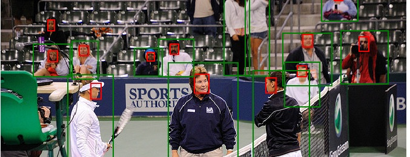

# faces4coco dataset

Over half of the 120,000 images in the 2017 [COCO(Common Objects in Context)](http://cocodataset.org/) dataset contain people,
and while COCO's bounding box annotations include some 90 different classes, there is only one class
for people.
Those bounding boxes encompass the entire body of the person (head, body, and extremities), but being able
to detect and isolate specific parts is useful and has many applications in machine learning.
Detecting faces in particular is useful, so we've created a dataset that adds faces to COCO.

## Downloads

|:---|:-----|------:|
| **Faces for COCO** | A CSV for each image in the Train2017 and Val2017 datasets | [Download](https://drive.google.com/open?id=1ZN3bI8uik0d_xcCBY3WdokkSboTnurry) |
| **COCO Annotations** | Faces for COCO plus people. Same JSON format as the original COCO set. | [Download](https://drive.google.com/open?id=19MBDKp4F2SJuI3xalyvY2CqZKRw7qUUe) |
| **Darknet Annotations (CLIPPED)** | Same thing, but in darknet/YOLO format. See details below. | [Download](https://drive.google.com/open?id=1Ivw40CBIWp90uJ0uFj9KcHJF1Mibc2ap) |
| **Darknet Annotations (NON-CLIPPED)** | Same thing, but in darknet/YOLO format. See details below. | [Download](https://drive.google.com/open?id=1cZX2QXohXI94QvYmyDYmRf9MT4YfudcA) |

## Details
There are existing face detection datasets like [WIDER FACE](http://shuoyang1213.me/WIDERFACE/), but they don't provide the additional
bounding boxes that come with COCO, especially `people`. So, we used a face detection model to
automatically find faces in the COCO images and created bounding box annotations.
Note that there was minimal QA on these bounding boxes, but we find
that the results are still quite good. If you see errors, please let us know.

### Face Detection
To generate face labels, we modified [yoloface](https://github.com/sthanhng/yoloface), which is a yoloV3 architecture, implemented in
 Tensorflow, and trained on the [WIDER FACE dataset](http://shuoyang1213.me/WIDERFACE/). Our modifications allowed us to speed up
 batch inference so that processing all of COCO 2017 took 16.5 hours on a GeForce GTX 1070 laptop w/ SSD. *We will release our modifications soon.*

For arguments, we used:
* score = 0.2
* iou = 0.5
* image-size: (416, 416)

Note: We chose a relatively low threshold so that we could process all the images once, and decide
on a final threshold during later processing.

### Format

For each image in the 2017 COCO dataset (val and train), we created a
single csv where each crowd is a detected face using yoloface.
If an image has no detected faces, it's represented by an empty CSV.

The columns of the CSV are as follows:

`image_path, score, top, left, bottom, right`

* `image_path` is a path to the image, and assumes a parent directory of `/data/coco/[val2017,train2017]``
* `score` is a float in [0, 1], the confidence score output by the yoloface model
* `top, left` pixel coordinate of the upper-left of the bounding box `**``
* `bottom, right` pixel coordinate of the lower-right of the bounding box `**`

`**` Note that the pixel coordinates are of the original images and are floats and not integers.
This is because a face boundary need not lie strictly between two pixels.
Also, the face predictions may create a bounding box that extends beyond the actual image, often
when a face is cropped.

## COCO annotations for "face" and "person"

Our own goal for this dataset was to train a face+person yolo model using COCO, so we have
provided these annotations as well for download in COCO and darknet formats.

Not every image in 2017 COCO has people in them and many images have a single "crowd" label instead of
individual "people" labels for everyone. Here's a breakdown:

* Total images: 118287
* Number without any object: 1021
* Number without person: 53151
* Number with person: 64115
* Number with crowd: 9115

In order to avoid examples where we knew the data was problematic, we chose to make
some exclusions:

We excluded all images that had a "crowd" label or did not have a "person" label.
* 9,155 images with the "crowd" label.
* 53,151 images that didn't have any "person" label.

We also excluded all face annotations with a confidence less than 0.7.

In some cases, there are detected faces that do not overlap with any person bounding box.
These annotations are included, but with an attribute `intersects_person = 0` .
The faces that do intersect a person box have `intersects_person = 1`.

The result is 58903 annotated images.

## Darknet annotations for "face" and "person"

We then converted the COCO annotations above into the darknet format used by YOLO. YOLO requires a space separated format of:

`CLASS X-CENTER Y-CENTER WIDTH HEIGHT`

* `CLASS` is an integer that maps to the class. For our dataset, `0`
  is `person` and `1` is `face`
* `X-CENTER, Y-CENTER` is the relative `(x,y)` of the center coordinates
  as a float where `0.0 0.0` is the top-left and `1.0 1.0` is the
  lower-right of the image. `**`
* `WIDTH, HEIGHT` are also relative floats where `0.0` is a 0%
  width/height and `1.0` would be 100% `**`

As per `**`, we decided to create two different darknet sets, one where we clip these coordinates to
[0, 1] and another where we do not clip them meaning the bounding box may partially fall beyond
the bounds of the image. If in doubt, use the standard (clipped) version.
